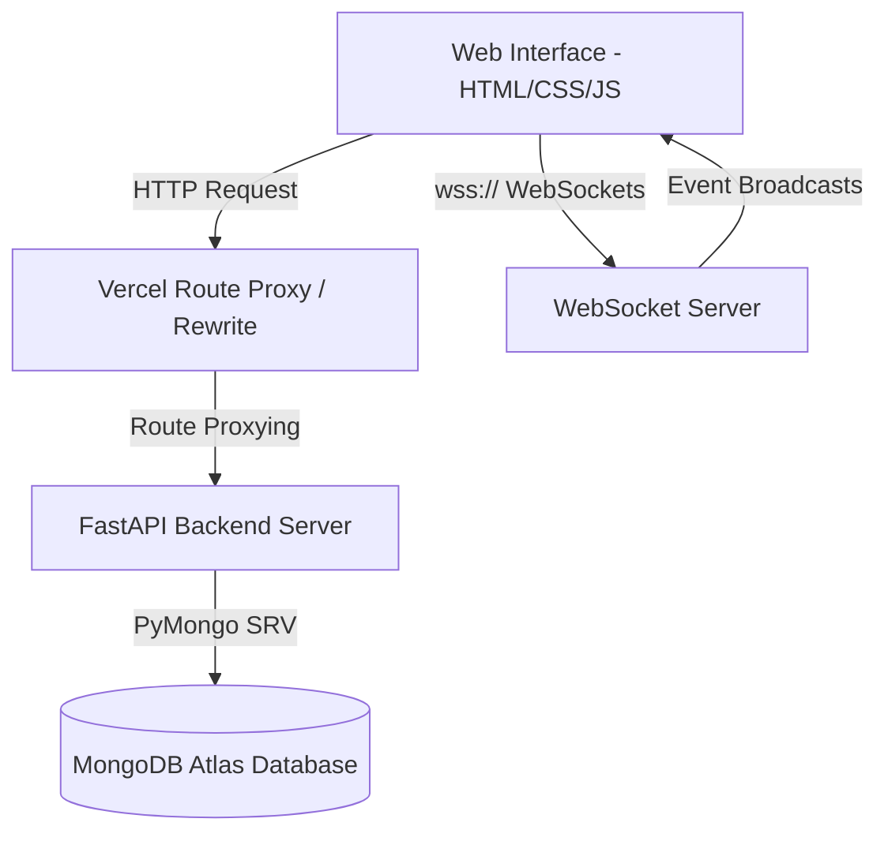

# KKR Fan Hub 🏏

Welcome to the **KKR Fan Hub**, a high-performance, production-ready full-stack web application designed for fans of the **Kolkata Knight Riders (KKR)**.

## 🚀 Live Deployment

### 🌐 Frontend (Vercel)
https://kkr-fan-hub.vercel.app

### ⚙ Backend API (Render)
https://kkr-fan-hub.onrender.com

### ❤️ Health Check
https://kkr-fan-hub.onrender.com/health

---

This repository implements a premium user interface with interactive elements, real-time WebSocket messaging rooms, secure JWT authentication, and a complete administrative CRUD dashboard backend connected to MongoDB Atlas.

---

## 🏗 System Architecture

The following diagram illustrates the network boundary, dynamic routing logic, and data flow of the application:



---

## ⚡ Tech Stack & Features

### Tech Stack
- **Frontend**: Vanilla HTML5, modern CSS3 (with custom variables, grid, flexbox, glassmorphic layout models), and pure ES6+ Javascript.
- **Backend**: FastAPI (Python 3.11), Gunicorn/Uvicorn, Pydantic v2 schemas.
- **Database**: MongoDB Atlas with PyMongo driver, unique indices, and atomic operators.
- **Deployment**: Vercel (static web client), Render (Docker containers), and MongoDB Atlas (cloud cluster).

### Core Features
- **Real-Time Interactive Fan Zone**:
  - **Cheers Wall**: Post cheers with instantaneous update propagation via `/ws/cheers`.
  - **MVP Poll**: Cast votes dynamically and view real-time update graphs via `/ws/poll`.

- **Administrative Portal**:
  - Secure CRUD panel allowing admins (`role == "admin"`) to manage:
    - match schedules
    - news articles
    - squad lists
    - trivia quizzes
    - legendary profiles

- **Cryptographic Security**:
  - Secure JWT authentication
  - Password hashing using bcrypt
  - OAuth2 bearer token flow
  - Role-based authorization dependencies

- **Performance Optimizations**:
  - GZip compression
  - Dynamic browser caching
  - Lazy image loading
  - Skeleton loading animations
  - Responsive mobile layouts

---

## 📂 Codebase Directory Structure

```txt
KKR fan web/
├── backend/
│   ├── routes/
│   │   ├── admin.py
│   │   ├── auth.py
│   │   ├── websocket.py
│   │   └── ...
│   ├── services/
│   ├── utils/
│   │   ├── logger.py
│   │   ├── security.py
│   │   └── websocket_manager.py
│   ├── database.py
│   ├── main.py
│   ├── Dockerfile
│   └── requirements.txt
│
├── frontend/
│   ├── app.js
│   ├── style.css
│   └── index.html
│
├── vercel.json
├── render.yaml
└── README.md
```

---

## 🔌 API & WebSocket Documentation

### REST API Endpoints

| Method | Endpoint | Access | Description |
|---|---|---|---|
| GET | `/health` | Public | Verifies API and DB connectivity |
| POST | `/api/auth/signup` | Public | Registers a new user |
| POST | `/api/auth/token` | Public | Returns JWT access token |
| GET | `/api/auth/verify` | Public | Validates token status |
| GET | `/api/players` | Public | Retrieves roster list |
| GET | `/api/matches` | Public | Retrieves match schedule |
| GET | `/api/news` | Public | Retrieves news updates |
| POST | `/api/cheers` | Public | Adds fan cheer |
| POST | `/api/poll` | Public | Casts MVP vote |
| POST | `/api/admin/players` | Admin | Create player |
| PUT | `/api/admin/players/{id}` | Admin | Update player |
| DELETE | `/api/admin/players/{id}` | Admin | Delete player |

---

## 🔌 WebSocket Rooms

### Cheers Room
Endpoint:
```txt
wss://kkr-fan-hub.onrender.com/ws/cheers
```

Payload:
```json
{
  "event": "cheer_update",
  "data": [
    {
      "name": "Fan A",
      "msg": "Go KKR!",
      "time": "May 27"
    }
  ]
}
```

### Poll Room
Endpoint:
```txt
wss://kkr-fan-hub.onrender.com/ws/poll
```

Payload:
```json
{
  "event": "poll_update",
  "data": {
    "votes": [45, 29, 18, 12],
    "labels": [
      "Sunil Narine",
      "Rinku Singh",
      "Varun Chakravarthy",
      "Quinton de Kock"
    ]
  }
}
```

---

## 🚀 Deployment Instructions

### 1. MongoDB Atlas Setup
- Create a free M0 cluster
- Add database user
- Allow IP access:
  ```txt
  0.0.0.0/0
  ```
- Copy MongoDB URI

### 2. Backend Deployment (Render)
1. Create Render Blueprint service
2. Connect GitHub repository
3. Configure environment variables:
   ```env
   MONGO_URI=
   DATABASE_NAME=
   SECRET_KEY=
   ALGORITHM=HS256
   ACCESS_TOKEN_EXPIRE_MINUTES=60
   ```
4. Deploy backend

### 3. Frontend Deployment (Vercel)
1. Import GitHub repository
2. Set frontend root directory
3. Deploy frontend
4. Configure production rewrites

---

## 🏃 Local Development Setup

### Install Dependencies
```bash
pip install -r requirements.txt
```

### Configure Environment Variables
Create:
```txt
backend/.env
```

Add:
```env
MONGO_URI=mongodb+srv://...
DATABASE_NAME=kkr_fan_hub
SECRET_KEY=your_secret_key
ALGORITHM=HS256
ACCESS_TOKEN_EXPIRE_MINUTES=60
```

### Run Development Servers
```bash
python run_servers.py
```

### Run Tests
```bash
python backend/test_services.py
```

---

## ✨ Highlights

- Production-ready FastAPI backend
- MongoDB Atlas cloud database integration
- JWT Authentication System
- Real-time WebSocket architecture
- Responsive UI design
- Vercel + Render cloud deployment
- Docker-ready infrastructure
- Offline fallback architecture
- Secure admin CRUD system
- Modular scalable backend architecture

---

## 📸 Screenshots

_Add screenshots here later:_
- Hero Section
- Squad Cards
- Legends Section
- Fan Zone
- Real-Time Polls
- Mobile Responsive View
- Swagger/OpenAPI Docs

---

## 👨‍💻 Author

Developed by **Souvik Samaddar**

Passionate about:
- Full Stack Development
- Backend Systems
- Real-Time Architectures
- Sports Fan Platforms
- Cloud Deployment
   
