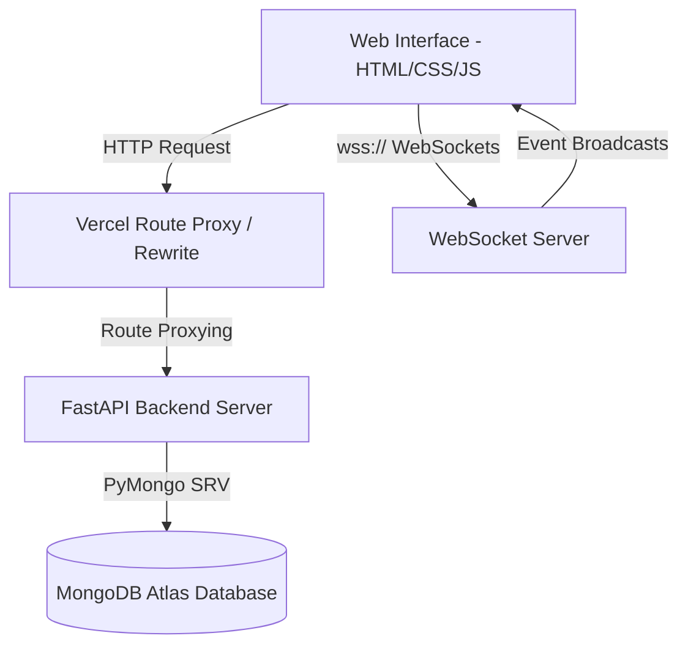

# KKR Fan Hub 🏏

Welcome to the **KKR Fan Hub**, a high-performance, production-ready full-stack web application designed for fans of the **Kolkata Knight Riders (KKR)**. 

This repository implements a premium user interface with interactive elements, real-time WebSocket messaging rooms, secure JWT authentication, and a complete administrative CRUD dashboard backend connected to MongoDB Atlas.

---

## 🏗 System Architecture

The following diagram illustrates the network boundary, dynamic routing logic, and data flow of the application:



---

## ⚡ Tech Stack & Features

### Tech Stack
- **Frontend**: Vanilla HTML5, modern CSS3 (with custom variables, grid, flexbox, glassmorphic layout models), and pure ES6+ Javascript.
- **Backend**: FastAPI (Python 3.11), Gunicorn/Uvicorn, Pydantic v2 schemas.
- **Database**: MongoDB Atlas with PyMongo driver, unique indices, and atomic operators.
- **Deployment**: Vercel (static web client), Render (Docker containers), and MongoDB Atlas (cloud cluster).

### Core Features
- **Real-Time Interactive Fan Zone**:
  - **Cheers Wall**: Post cheers with instantaneous update propagation via `/ws/cheers`.
  - **MVP Poll**: Cast votes dynamically and view real-time update graphs via `/ws/poll`.
- **Administrative Portal**: Secure CRUD panel allowing admins (`role == "admin"`) to manage match schedules, news articles, squad lists, trivia quizzes, and legendary profiles.
- **Cryptographic Security**: Secure authentication flows utilizing standard JWT tokens, password hashing with `bcrypt`, OAuth2 password bearer schemes, and strict role-based permission dependencies.
- **Performance Optimizations**:
  - **GZip Compression**: Minimizes network payloads larger than 1KB.
  - **Dynamic Response Caching**: Native middleware appending `Cache-Control` browser caching headers on static read-only endpoints.
  - **Lazy Image Loading**: Injected `loading="lazy"` tags on dyn-rendered rosters, modals, and avatars.
  - **Shimmer Skeletons**: CSS-animated loading states to prevent layout shifts.

---

## 📂 Codebase Directory Structure

```
KKR fan web/
├── backend/
│   ├── routes/
│   │   ├── admin.py          # Admin CRUD APIs (POST/PUT/DELETE)
│   │   ├── auth.py           # Authenticate, Signup, Profile (/me)
│   │   ├── websocket.py      # Real-time WebSocket connection endpoints
│   │   └── ...               # Public GET endpoint routers (matches, players, etc.)
│   ├── services/             # Database access and business logic services
│   ├── utils/
│   │   ├── logger.py         # Dynamic stderr logger level parser
│   │   ├── security.py       # Password encryption helpers
│   │   └── websocket_manager.py # WebSocket room tracking & safelimit (500 connections)
│   ├── database.py           # Atlas connections, schema seeding, collection indexers
│   ├── main.py               # App entrypoint, Middlewares (Gzip, TrustedHost, CORS)
│   ├── Dockerfile            # Container definition respecting Render PORT overrides
│   └── requirements.txt      # Python deployment dependencies list
├── frontend/
│   ├── app.js                # Core JS logic: Websockets client, skeleton triggers, auth, API calls
│   ├── style.css             # Styling layout, shimmering keyframes, glassmorphism UI variables
│   └── index.html            # Markup structural bones with modern layout components
├── vercel.json               # Vercel deployment and routing rules mapping
└── render.yaml               # Render Infrastructure-as-code Blueprint
```

---

## 🔌 API & WebSocket Documentation

### REST API Endpoints

| Method | Endpoint | Access | Description |
|---|---|---|---|
| `GET` | `/health` | Public | Status check verifying DB connectivity status |
| `POST` | `/api/auth/signup` | Public | Normalizes credentials, hashes password, registers new user |
| `POST` | `/api/auth/token` | Public | OAuth2 token endpoint returning JWT bearer token |
| `GET` | `/api/auth/verify` | Public | Validates access token validity status |
| `GET` | `/api/players` | Public | Retrieves roster list (Cached) |
| `GET` | `/api/matches` | Public | Retrieves 2026 fixture calendar (Cached) |
| `GET` | `/api/news` | Public | Queries news updates with search filter (Cached) |
| `POST` | `/api/cheers` | Public | Submits a cheer message & triggers WebSocket broadcasts |
| `POST` | `/api/poll` | Public | Casts an MVP vote & triggers WebSocket broadcasts |
| `POST` | `/api/admin/players` | Admin | Adds a new player profile |
| `PUT` | `/api/admin/players/{id}` | Admin | Modifies an existing player profile |
| `DELETE` | `/api/admin/players/{id}` | Admin | Removes a player profile |

### WebSocket Rooms & Payloads

1. **Cheers Wall Room (`/ws/cheers`)**:
   - Connection Handshake: `ws://https://kkr-fan-hub.onrender.com:5000/ws/cheers`
   - Broadcast Payload:
     ```json
     {
       "event": "cheer_update",
       "data": [
         { "name": "Fan A", "msg": "Go KKR!", "time": "May 27" },
         ...
       ]
     }
     ```
2. **MVP Poll Room (`/ws/poll`)**:
   - Connection Handshake: `ws://https://kkr-fan-hub.onrender.com:5000/ws/poll`
   - Broadcast Payload:
     ```json
     {
       "event": "poll_update",
       "data": {
         "votes": [45, 29, 18, 12],
         "labels": ["Sunil Narine", "Rinku Singh", "Varun Chakravarthy", "Quinton de Kock"]
       }
     }
     ```

---

## 🚀 Deployment Instructions

### 1. MongoDB Atlas Configuration
- Deploy a free M0 tier cluster.
- Create a database user and white-list IP `0.0.0.0/0` (Allow Access from Anywhere).
- Copy your connection URI string.

### 2. Render Backend Deployment
Render deploys via the included `render.yaml` blueprint:
1. Create a **Blueprint** service on Render.
2. Link your Git repository.
3. Render will parse the `render.yaml` and configure the container environments.
4. Input your `MONGO_URI` when prompted by the dashboard.

### 3. Vercel Frontend Deployment
1. Import your project repository into Vercel.
2. Ensure the root directory is set to the project root (where `vercel.json` is located).
3. Deploy! Vercel's rewrite rules in `vercel.json` automatically map `/api` routes to your backend.

---

## 🏃 Local Development Quickstart

1. Install requirements:
   ```bash
   pip install -r requirements.txt
   ```
2. Set up local development variables in `backend/.env`:
   ```env
   MONGO_URI=mongodb+srv://...
   DATABASE_NAME=kkr_fan_hub
   SECRET_KEY=b94d92349b06d8057422199d034bbc87c7397b87457dc46040ec19945be8d278
   ALGORITHM=HS256
   ACCESS_TOKEN_EXPIRE_MINUTES=60
   ```
3. Run the development runner:
   ```bash
   python run_servers.py
   ```
4. Verify backend functionality:
   ```bash
   python backend/test_services.py
   ```
