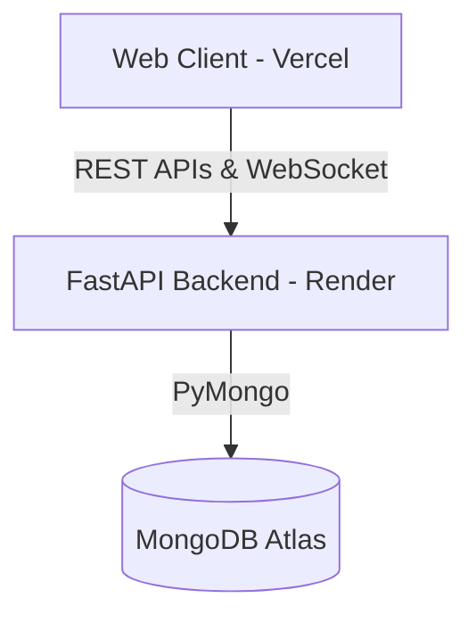

# Production Deployment Guide - KKR Fan Hub

This guide provides complete instructions for deploying the KKR Fan Hub project to production. We use **Vercel** for the frontend static client, **Render** (via Docker) for the FastAPI backend, and **MongoDB Atlas** for the database.

---

## 🏗 Architecture Blueprint



---

## 1. MongoDB Atlas Setup (Database)

1. **Create an Account**: Register or log in to [MongoDB Atlas](https://www.mongodb.com/cloud/atlas).
2. **Deploy a Free Cluster**: Set up a new shared cluster (e.g. M0 tier) on AWS/GCP.
3. **Database Access User**:
   - Create a database user (e.g. `kkr_user`).
   - Use a strong generated password.
   - Assign the role `Read and Write to any database`.
4. **Network Access**:
   - Add `0.0.0.0/0` (Allow Access from Anywhere) to the IP Access List so that Render's dynamic container IPs can connect.
5. **Get Connection String**:
   - Click **Connect** -> **Drivers** -> **Python**.
   - Copy the SRV URI connection string: `mongodb+srv://<username>:<password>@your-cluster.mongodb.net/?retryWrites=true&w=majority`
   - Keep this secure. **Never commit this URI to Git.**

---

## 2. Render Deployment (FastAPI Backend)

Render will automatically deploy the backend using Infrastructure-as-Code via the provided `render.yaml` or through manual dashboard configuration.

### Option A: Using the Render Blueprint (`render.yaml`)
1. Commit the `render.yaml` and `.dockerignore` files to your Git repository.
2. Log in to [Render](https://render.com).
3. Click **New +** -> **Blueprint**.
4. Select your repository. Render will automatically parse the `render.yaml` file and create the web service.
5. Update the connection string values when prompted for `MONGO_URI`.

### Option B: Manual Setup via Dashboard
1. Click **New +** -> **Web Service**.
2. Connect your Git repository.
3. Configure the following parameters:
   - **Name**: `kkr-fan-hub-backend`
   - **Environment**: `Docker`
   - **Docker Context**: `backend`
   - **Dockerfile Path**: `backend/Dockerfile`
   - **Instance Type**: `Free`
4. Add the following **Environment Variables**:

| Variable Name | Example Production Value | Description |
|---|---|---|
| `ENVIRONMENT` | `production` | Enables production mode logs & optimizations |
| `MONGO_URI` | `mongodb+srv://...` | Connection URI from MongoDB Atlas |
| `DATABASE_NAME` | `kkr_fan_hub` | Target production database name |
| `SECRET_KEY` | `your_long_secure_jwt_secret_hex` | Long secure key for JWT signatures |
| `ALGORITHM` | `HS256` | JWT hash algorithm |
| `ACCESS_TOKEN_EXPIRE_MINUTES` | `60` | Expiration limit for active JWT sessions |
| `ALLOWED_ORIGINS` | `https://kkr-fan-hub-frontend.vercel.app` | URL of your deployed frontend on Vercel |
| `FRONTEND_URL` | `https://kkr-fan-hub-frontend.vercel.app` | Helper for CORS dynamic mapping |
| `ALLOWED_HOSTS` | `*` | List of allowed hosts (or specific Render domains) |
| `LOG_LEVEL` | `INFO` | Standard production logger setting |

> [!NOTE]
> **Render WebSockets Support**: WebSockets work natively out-of-the-box on Render's Web Services. Ensure you connect using `wss://` (secure WebSocket protocol) to prevent mixed-content blocks by browsers.

---

## 3. Vercel Deployment (Frontend Static Client)

1. Log in to [Vercel](https://vercel.com).
2. Click **Add New** -> **Project**.
3. Import your Git repository.
4. On the **Configure Project** step:
   - **Framework Preset**: `Other` (or static HTML)
   - **Root Directory**: `./` (Root directory containing `vercel.json` and `frontend/`)
5. Deploy the application. Vercel will automatically build the static assets and set up routing/rewriting proxy rules using the `vercel.json` config.

---

## 🔑 Secure Secrets Guidance

- **Never Commit Secrets**: Ensure `.env` is listed in your `.gitignore` file before pushing. We have configured the root `.gitignore` and `backend/.gitignore` to ignore environment configuration files automatically.
- **Render Secrets Management**: Use Render's native **Environment Groups** or dashboard fields to populate credentials securely instead of hardcoding them.
- **FastAPI Configuration**: Our backend uses `python-dotenv` which automatically falls back to system variables when `.env` is absent, which is standard container behavior.

---

## 🏃 Startup Commands

### Development
Start both servers locally (CORS automatically maps `localhost` ports):
```bash
python run_servers.py
```

### Production Running
Start the FastAPI server via Uvicorn manually (respects system PORT):
```bash
uvicorn backend.main:app --host 0.0.0.0 --port 8000
```
In Docker production builds, uvicorn runs via:
```bash
sh -c "uvicorn backend.main:app --host 0.0.0.0 --port ${PORT:-8000}"
```

---

## 🚀 Deployment Verification Checklist

- [ ] **Health Endpoint Check**: Verify that `GET https://your-backend.onrender.com/health` returns:
  ```json
  {"status": "healthy", "database": "connected"}
  ```
- [ ] **Gzip Compression**: Inspect response headers in network panel to confirm `Content-Encoding: gzip` is present on payloads larger than 1KB.
- [ ] **Host Hardening**: Confirm that request headers are validation-protected by TrustedHostMiddleware.
- [ ] **Mixed Content Compatibility**: Confirm frontend calls the backend using `https://` and WebSocket connections using `wss://`.
- [ ] **Real-time Broadcast**: Open two browser tabs on the MVP Poll or Cheers Wall. Submit a vote or post a cheer, and verify that the other tab updates instantly in real time.
